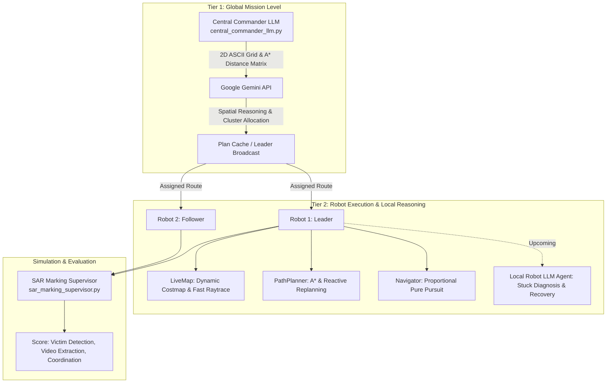

# AGENT.md: Project Onboarding & Architecture Guide

> **Welcome, Agent!**  
> This document is your complete briefing on this repository. It explains the original competition context, our core research/Final Year Project (FYP) objectives, the hierarchical LLM architecture, key files, technical lessons learned, and guidelines for collaborating with the user.

---

## 1. Executive Summary & Purpose

This project develops a **Hierarchical LLM-Powered Multi-Robot System (MRS) for Autonomous Search and Rescue (SAR)**.

We utilize the **2026 IEEE SMCS Robot Competition Phase 1** benchmark simulation environment in **Webots** to research and evaluate how Large Language Models (LLMs) can enhance multi-robot coordination, spatial task allocation, failure diagnosis, and autonomous physical recovery.



---

## 2. The Original IEEE SMCS Competition

### 2.1 Overview
- **Competition:** 2026 IEEE Systems, Man, and Cybernetics Society (SMCS) Robot Competition (Phase 1).
- **Simulator:** Webots (world file: [`worlds/small_world.wbt`](file:///home/taha/Desktop/2026-ieee-smcs-competition-phase-1/worlds/small_world.wbt)).
- **Robots:** Two differential-drive **Husarion ROSbot 2.0** platforms (`robot1`, `robot2`).
- **Victims:** 4 human victim models placed across different rooms (`victim1` to `victim4`).

### 2.2 Sensor & Actuator Suite (Per Robot)
- **Lidar:** `RpLidarA2` (`laser`), 360° FoV ($2\pi$ rad), ranges up to 12.0m.
- **Cameras:** RGB camera (`camera rgb`) and Depth camera (`camera depth`).
- **Odometry & IMU:** 4 wheel position encoders, IMU accelerometer, gyro, and compass.
- **Communication:** Webots `Emitter` and `Receiver` nodes for:
  - Robot-to-Supervisor channel (sending victim alerts).
  - Robot-to-Robot squad channel (inter-agent state broadcasting).

### 2.3 Scoring & Supervisor
- **Supervisor Controller:** [`controllers/sar_marking_supervisor/sar_marking_supervisor.py`](file:///home/taha/Desktop/2026-ieee-smcs-competition-phase-1/controllers/sar_marking_supervisor/sar_marking_supervisor.py)
- **Scoring Metrics:**
  1. **Victim Detection:** Locating all 4 victims within the time limit.
  2. **Coordination Score:** Geographic separation, zero redundant search, minimal corridor congestion.
  3. **Video Information Extraction:** Camera/vision confirmation.
- **Mission Duration:** Default 180s (can be extended to 240s/300s for testing in supervisor line 41).

---

## 3. Our Multi-Tier LLM Architecture

Our research moves beyond purely deterministic algorithms by dividing robot cognition into two distinct tiers:

### Tier 1: Central Commander LLM (Implemented & Verified ✅)
- **Location:** [`controllers/proposed_solution/central_commander_llm.py`](file:///home/taha/Desktop/2026-ieee-smcs-competition-phase-1/controllers/proposed_solution/central_commander_llm.py)
- **Role:** High-level strategic mission planner.
- **Inputs to LLM:**
  1. **2D ASCII Occupancy Grid ($20 \times 20$):** `#` = wall, `.` = free space, `1`/`2` = robots, `A`/`B`/`C`/`D` = victims. *(Note: We use grid/numerical spatial inputs, not pre-labeled human room names, keeping it realistic).*
  2. **Exact Origin-Relative Entity Coordinates.**
  3. **Robot-to-Victim Navigable A\* Distance Matrix.**
  4. **Inter-Victim Navigable A\* Distance Matrix.**
- **Model:** Google Gemini (`gemini-flash-latest` / `gemini-3.6-flash`) via `google-genai` SDK with deterministic spatial fallback.
- **Leader-Follower Synchronization:**
  - `robot1` queries Gemini once at startup and saves the verified plan to `sim_logs/central_llm_plan.json`.
  - `robot2` waits for `robot1`'s plan to avoid duplicate API calls, rate limits, and role-swapping race conditions.

### Tier 2: Local Embodied Robot LLM Agent (Active Development 🚧)
- **Role:** On-robot cognitive supervisory layer running locally on each robot.
- **Problem Being Solved:** Static 2D blueprint maps only capture walls. Unmapped 3D furniture (armchairs, tables, cabinets, fallen objects) can cause wheel slip, physical bumper entrapment, or narrow doorway blockages.
- **Tool-Using Agent Design:**
  - `inspect_state()`: Reads odometry delta, linear speed, IMU jerk, and distance sensors.
  - `diagnose_stuck_condition()`: Detects if commanded wheel speed $> 0$ but displacement $< 0.05\text{m}$ for $>2\text{s}$.
  - `execute_recovery(reverse_dist, turn_angle)`: Backs out of collision bounding boxes and pivots away.
  - `mark_dynamic_obstacle(x, y, radius)`: Injects unmapped obstacles into `LiveMap` and triggers A\* detours.

---

## 4. Codebase Directory & Key Files

```text
2026-ieee-smcs-competition-phase-1/
├── AGENT.md                                   # This onboarding guide
├── .env                                       # GEMINI_API_KEY (loaded via python-dotenv)
├── README.md                                  # Upstream competition instructions
├── worlds/
│   └── small_world.wbt                        # 3D Webots simulation world
├── protos/
│   └── Rosbot.proto                           # Robot physical and kinematic definition
└── controllers/
    ├── sar_marking_supervisor/
    │   └── sar_marking_supervisor.py          # Ground-truth evaluation supervisor
    └── proposed_solution/
        ├── proposed_solution.py               # Main robot entrypoint & state machine
        ├── central_commander_llm.py           # Tier 1 Global LLM mission allocator
        ├── path_planner.py                    # 2D Grid A* planner & is_path_blocked checker
        ├── live_map.py                        # Real-time Lidar costmap & raytrace clearing
        ├── navigator.py                       # Proportional pure-pursuit waypoint follower
        ├── odometry.py                        # Wheel encoder odometry & heading tracker
        └── sim_logs/                          # Generated runtime artifacts
            ├── map_estimate.png               # Extracted blueprint wall map
            ├── map_metadata.json              # World-to-pixel coordinate transform
            ├── central_llm_plan.json          # Synchronized mission plan
            ├── live_map_debug_robot1.png      # Real-time perception debug map (Robot 1)
            └── live_map_debug_robot2.png      # Real-time perception debug map (Robot 2)
```

---

## 5. File-by-File Breakdown

### 1. [`proposed_solution.py`](file:///home/taha/Desktop/2026-ieee-smcs-competition-phase-1/controllers/proposed_solution/proposed_solution.py)
- **Class:** `BasicRosbotController`
- **Responsibilities:**
  - Loads `.env` via `python-dotenv`.
  - Initializes all Webots devices (motors, position sensors, lidar, IMU, emitters/receivers).
  - Handles Leader-Follower startup (`robot1` allocates via LLM, `robot2` waits).
  - Main loop (`set_explore_behavior`): Updates `LiveMap`, checks `is_path_blocked`, triggers event-driven A\* replanning, stops motors on blockage, and exports visual debug maps.

### 2. [`central_commander_llm.py`](file:///home/taha/Desktop/2026-ieee-smcs-competition-phase-1/controllers/proposed_solution/central_commander_llm.py)
- **Class:** `CentralCommanderLLM`
- **Responsibilities:**
  - Generates the $20 \times 20$ ASCII grid and A\* pairwise distance matrices.
  - Formats the prompt and queries Google Gemini using `google.genai.Client`.
  - Saves synchronized plan to `sim_logs/central_llm_plan.json`.
  - Provides deterministic spatial clustering fallback when offline.

### 3. [`path_planner.py`](file:///home/taha/Desktop/2026-ieee-smcs-competition-phase-1/controllers/proposed_solution/path_planner.py)
- **Class:** `PathPlanner`
- **Key Methods:**
  - `plan(start_x, start_y, goal_x, goal_y)`: A\* search on static binary grid with line-of-sight path smoothing.
  - `replan_on_grid(live_grid, ...)`: A\* replanning on dynamic live costmap with robot start and victim goal clearance zones.
  - `is_path_blocked(live_grid, start_x, start_y, waypoints)`: Fast Bresenham ray check along upcoming waypoints to detect unmapped furniture.

### 4. [`live_map.py`](file:///home/taha/Desktop/2026-ieee-smcs-competition-phase-1/controllers/proposed_solution/live_map.py)
- **Class:** `LiveMap`
- **Key Features:**
  - Pre-inflates static base walls once at startup (`self._base_inflated_grid`).
  - Active Bresenham raytrace clearing: Clears free space along Lidar rays so open corridors never get choked by noise.
  - Microsecond on-the-fly dynamic inflation for detected furniture.
  - `save_debug_image()`: Generates color-coded RGB perception images (`live_map_debug_robot1.png`).

### 5. [`navigator.py`](file:///home/taha/Desktop/2026-ieee-smcs-competition-phase-1/controllers/proposed_solution/navigator.py)
- **Class:** `Navigator`
- **Parameters:**
  - `BASE_SPEED = 15.0 rad/s`: High-speed cruise velocity.
  - `MAX_SPEED = 25.0 rad/s`: Maximum motor rotation cap.
  - `TURN_GAIN = 8.0`: Proportional heading error correction.
  - `ARRIVAL_DIST = 0.30 m`: Waypoint consumption radius.
- **Key Feature:** Rotates in place (`forward = 0.0`) on sharp turns ($> 25^\circ$) to avoid cutting corners into doorframes.

---

## 6. Critical Technical Insights & Lessons Learned

1. **Webots Lidar Sensor Frame:**
   - Webots `RpLidarA2` indexes rays starting from **$-fov/2$ to $+fov/2$** (not $0$ to $fov$).
   - Correct formula: `angle = -fov / 2.0 + (i / n_pts) * fov`.
2. **Ghost Obstacles in Costmaps:**
   - Never maintain a permanent separate inflated layer where points are added with a radius and cleared with single-pixel rays.
   - Always clear raw hit points with raytracing, and construct inflation dynamically on the fly from currently active hits.
3. **Synchronous Physics Barrier in Webots:**
   - Webots controller processes run in lockstep. If Robot 1 hangs in a tight CPU loop (e.g. A\* running 30 times/sec on failure), Robot 2 and the entire simulation freeze!
   - Always throttle replanning ($0.4\text{s}$ cooldown) and stop motors (`set_wheel_speeds(0, 0)`) when no path is found.
4. **Origin Relative vs Absolute Coordinates:**
   - The world origin marker is at `[-11.5, -7.5, 0.002]`.
   - All robot controllers, waypoints, and victim targets use **Origin-Relative Coordinates** $(x, y) = (x_{world} + 11.5, y_{world} + 7.5)$.

---

## 7. Guidelines for Future Agents

- **Explain Before Editing:** Always explain the physical and algorithmic root cause clearly to the user before proposing code modifications.
- **Preserve SDK Conventions:** Use the official `from google import genai` SDK and load keys via `python-dotenv`.
- **Use Visual Debuggers:** Use `sim_logs/live_map_debug_robot1.png` and `sim_logs/live_map_debug_robot2.png` to verify perception and navigation state visually.
- **Markdown Links:** Always format file references using clickable GitHub Markdown links (e.g. `[proposed_solution.py](file:///home/taha/Desktop/2026-ieee-smcs-competition-phase-1/controllers/proposed_solution/proposed_solution.py)`).
